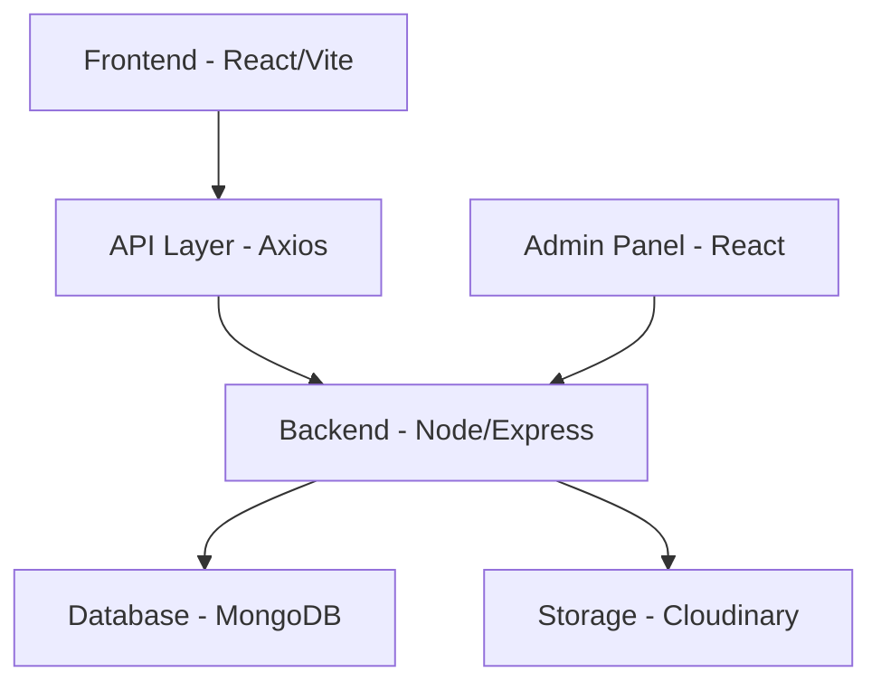

# 👕 Trend E-commerce Platform

A modern, high-performance e-commerce solution built with **React**, **Node.js**, **Express**, and **MongoDB**.

## 🏗️ Project Architecture

> [!NOTE] 
> For mobile users, the above diagram is best viewed in landscape mode or by zooming.

## 🚀 Key Features
- **Secure Auth**: JWT stored in HTTP-only cookies.
- **Advanced Filtering**: Filter by price and sorting.
- **Dynamic UX**: Loading states, responsive design, and theme support.
- **Professional Hygiene**: Standardized directory casing and git-ignore patterns.

## 🛠️ Tech Stack
- **Frontend**: React 19, GSAP, Axios, Lucide Icons.
- **Backend**: Express, MongoDB, Cloudinary, Cookie-parser.
- **Security**: JWT, secure cookies, CORS origin validation.

## 📖 Deployment Instructions
Please refer to [DEPLOYMENT.md](./DEPLOYMENT.md) for step-by-step instructions for Vercel, Render, and other platforms.

## ♿ Accessibility (WCAG 2.1 Level AA)
We've conducted a preliminary accessibility audit and implemented:
- **Semantic HTML**: Proper use of `<main>`, `<aside>`, `<nav>`, and `<header>`.
- **Keyboard Navigation**: Removed "annoying" outlines while maintaining focus visibility.
- **Contrast**: High contrast theme support.

## 👔 Recruiter Access (Admin)
The admin panel is accessible in local development at `http://localhost:5173/admin` (if running locally) or via the **Admin** link in the project footer.

---
Built with ❤️ by Antigravity.
