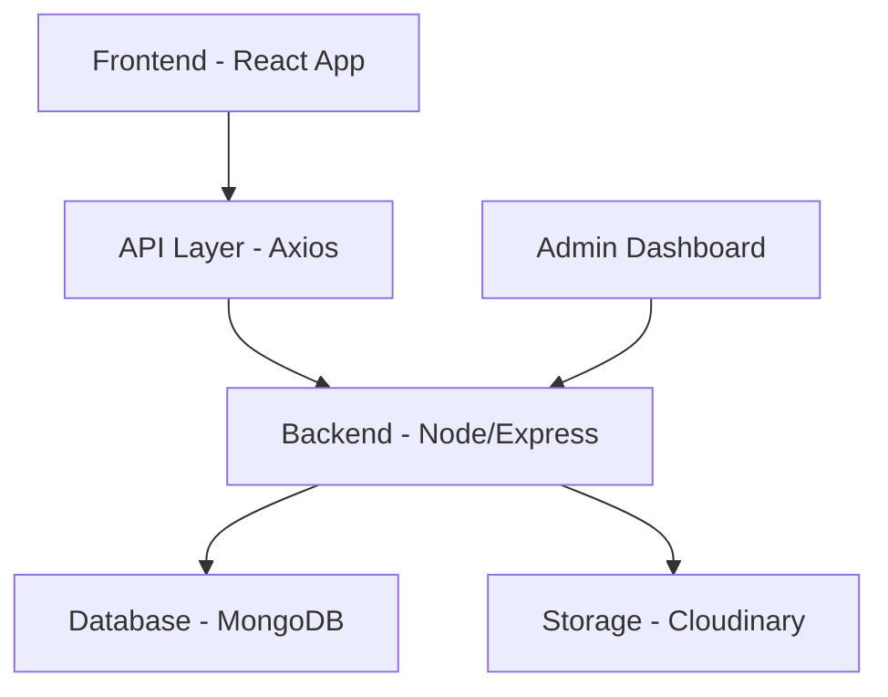

# 🛒 Trend Enterprise E-Commerce Platform


---

## 🌐 Live Application

🔗 **Live Demo:** [https://e-commerce2-rust.vercel.app/](https://e-commerce2-rust.vercel.app/)  
📦 **Repository:** [https://github.com/shaikazeem2001/E-commerce](https://github.com/shaikazeem2001/E-commerce)  

---

# 📌 Executive Summary

This is a production-ready, full-stack **Enterprise E-Commerce Platform** built using a modern, scalable architecture.

The platform provides:
- Secure JWT authentication & HTTP-only cookies
- Role-based access control (Admin & Users)
- Dynamic product management & Inventory control
- Optimized frontend performance with GSAP animations
- Scalable backend REST API with MongoDB
- Clean modular architecture

Designed with **security, performance, scalability, and maintainability** in mind.

# 🏗️ System Architecture

## 📊 High-Level Architecture



## 🧩 Folder Architecture

```text
E-commerce/
│
├── backend/        # Node.js + Express API
│   ├── controllers/
│   ├── middleware/
│   ├── models/
│   ├── routes/
│   └── config/
│
├── frontend/       # User-facing React Application
│   ├── components/
│   ├── pages/
│   ├── context/
│   └── assets/
│
├── admin/          # Admin Dashboard (Role-Based Access)
│   ├── components/
│   ├── pages/
│   └── services/
│
└── README.md
```

# 🔐 Authentication & Authorization

### 🔑 Authentication
- JWT-based authentication
- Password hashing using bcrypt
- Middleware-protected routes
- Token validation on every secured request

### 🛡 Authorization (Role-Based Access)
- **User Role**: Access to shopping, cart, and profile.
- **Admin Role**: Exclusive access to the Admin Panel.

Admin panel can:
- Add, update, and delete products
- Manage inventory in real-time

---

# 🚀 Core Features

## 🛍 User Features
- Advanced product filtering (Price Range 0-100k)
- Intelligent Sorting (Newest, Best Sellers, Price)
- Add to cart & dynamic updates
- Secure login/register with HTTP-only cookies
- Protected checkout flow
- Modern, responsive UI with Dark Mode support

## 🛠 Admin Features
- Product CRUD operations
- Secure role-based dashboard
- Cloudinary integration for image uploads
- Backend validation & error handling

---

# ⚙️ Technology Stack

### Frontend
- **React 19**
- **Axios** (Centralized API instance)
- **GSAP** (Smooth UI animations)
- **Lucide Icons**
- **Vite** (Build tool)

### Backend
- **Node.js & Express**
- **MongoDB & Mongoose**
- **JWT & Cookie-parser**
- **Cloudinary** (Asset management)

---

# 🔧 Installation Guide

## 1️⃣ Clone Repository
```bash
git clone https://github.com/shaikazeem2001/E-commerce.git
cd E-commerce
```

## 2️⃣ Backend Setup
```bash
cd backend
npm install
npm run dev
```
Create `.env` file (see `.env.example`):
```text
PORT=4000
MONGODB_URI=your_mongo_connection
JWT_SECRET=your_secret_key
CLOUDINARY_CLOUD_NAME=...
CLOUDINARY_API_KEY=...
CLOUDINARY_API_SECRET=...
```

## 3️⃣ Frontend Setup
```bash
cd frontend
npm install
npm run dev
```

---

# 🎯 Recruiter-Focused Highlights
✔ **Clean Code**: Standardized directory casing and modular structure.
✔ **Security**: Implemented JWT with HTTP-only cookies for session safety.
✔ **Scale**: Project organized with npm workspaces for easy monorepo management.
✔ **Performance**: Zero custom cursor lag, optimized GSAP ripples, and shimmer loading states.

---

# 👨‍💻 Author
**Azeem Shaik**  
MS in Computer Science | Full-Stack Developer  
GitHub: [shaikazeem2001](https://github.com/shaikazeem2001)

Built with ❤️ by Antigravity.
